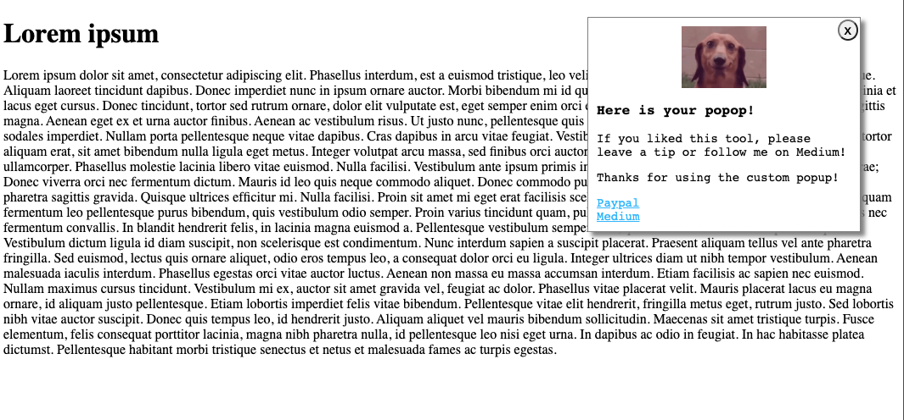
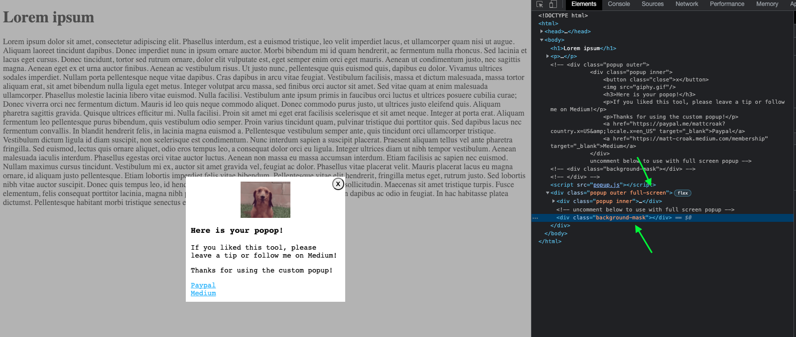

# Custom JavaScript Popup

A popup solution that requires no external libaries, frameworks, and is more robust (and customizable) than the default JavaScript alert. 

## Usage

Copy and past the HTML, CSS, and JavaScript into your existing files. Change the classes however you like, just make sure they are consistent throughout the three files AND don't conflict with your existing classes if you have any. 

### When Content Loads

If you want the popup to show up when the page loads, you can use the code that is provided by default. 

### Based on Other Content Actions

If you want the popup to show up on any other content actions, such as (but not limited to)...

- After a certain amount of time has elapsed
- After a certain request was made
- After the user scrolled down a certain amount of pixels 

...simply add the `hidden` class to the class list for the `popup outer` container element. This will hide the whole popup by default. Whenever you're ready to show the element, simply add the `unhide` function to whatever event will be used to trigger the display of the popup.

```javascript
const unhide = () =>{
    // use this function to unhide popup
    // can only unhide if the hide class was originally provided

    var container = document.getElementsByClassName("hidden")[0]
    if (container) container.classList.remove("hidden")
}
```

## Closing the Popup

There are two provided ways to remove the popup, which are found in the `hide` function.

```javascript
const hide = (e) => {
    // use below logic to remove from HTML body completely
    
    // e.target.parentElement.parentElement.remove()

    // use below logic to remove from HTML body temporarily 

    var container = e.target.parentElement.parentElement
    container.classList.add('hidden')
}
```
### Remove Popup Node Entirely (requires re-building)

First, you can simply remove the popup node from the body of your HTML. This will remove it permanently and if you want to re-open it at any point you will need to re-create the popup-code which is provided in `popup.js` in the function `constructPopup`.

```javascript 
const constructPopup = () => {
    // propbably not the most efficient solution to hiding the popup
    // but the code is here if for whatever reason you want to use it
    document.body.innerHTML += popupString;
}

const popupString = `
<div class="popup outer">
    <div class="popup inner">
        <button class="close">x</button>
        
        <h3>Here is your popop!</h3>
        <p>If you liked this tool, please leave a tip or follow me on Medium!</p>
        <p>Thanks for using the custom popup!</p>
        <a href="https://paypal.me/mattcroak?country.x=US&amp;locale.x=en_US" target="_blank">Paypal</a>
        <a href="https://matt-croak.medium.com/membership" target="_blank">Medium</a>
    </div>
    <!-- uncomment below to use with full screen popup -->
    <!-- <div class="background-mask"></div> -->
</div>
`
```

### Simply Hide Popup with CSS

The second way, mentioned earlier, is if you want to leave the popup in the DOM but simply hide it, you can use the provided `hide` function. Using `hide` will allow you to keep the popup elements in tact and on your page without obstructing the view for the user. To reshow the popup, just add the `unhide` function to whichever event you want to trigger the popup. This is more efficient than re-building the popup entirely as you only need to toggle the classes. 

## Position Options

There are two provided position options.

### Top Right

This is the default setting. The popup will appear on the top right of the webpage. You can alter the positioning in the CSS if you want it to appear anywhere else. 

See below.



### Full Screen

This is a setting that can be used if you want the popup to take up the whole screen and appear in the center of the page. To do this...

- Uncomment out ` <!-- <div class="background-mask"></div> -->`
- Add `full-screen` class to the classlist for `popup outer`.

See below.



## Animations

There are two provided animation options.

### Slide In

This animation allows the popup to slide in from offscreen. This animation works best with *Top Right* positioning. Enable this by changing the `animation-name` property for `popup outer` to `slide-in`.

### Zoom in

This animation allows the popup to zoom in on screen. This animation works best with *Full Screen* positioning. Enable this by changing the `animation-name` property for `popup outer` to `zoom-in`.

## Working Example

A working example can be found on [CodePen](https://codepen.io/macro6461/pen/zYLEWEo).

Please feel free to make pull requests to add more or refine existing code. I also welcome any and all feedback-positie or otherwise!

Feel free to follow me on [Medium](https://medium.com/@matt-croak). Upgrade to a Medium membership to ensure you have access to all of my posts! 

You can also onnect with me on [my other socials](https://linktr.ee/mattcroak) as well!

If you liked the custom popup, please [leave a Tip](https://paypal.me/mattcroak?country.x=US&amp;locale.x=en_US)!
